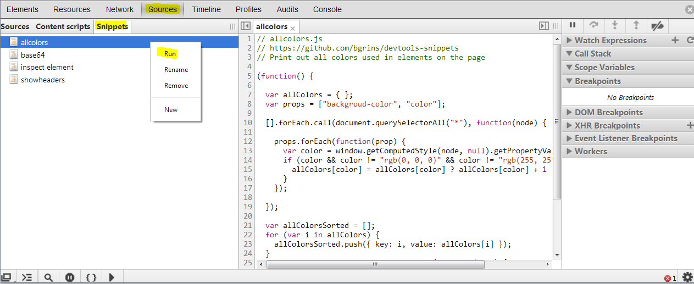
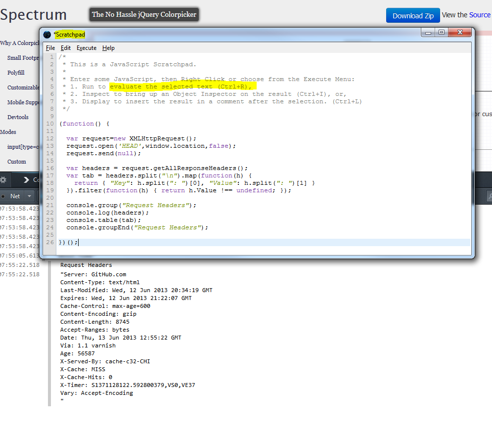
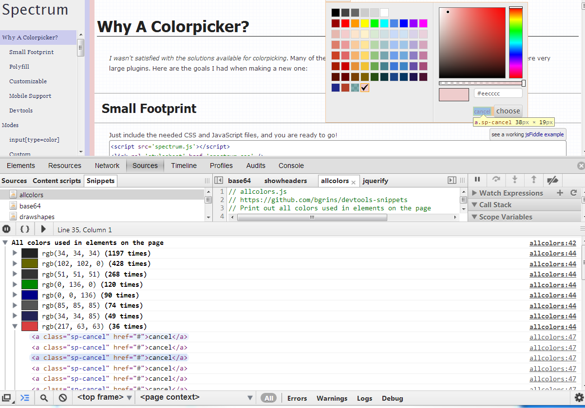

devtools-snippets
=================

A collection of helpful snippets for use inside of developer tools.

View them all on a single page: http://bgrins.github.io/devtools-snippets/ or all of them [inside of github](https://github.com/bgrins/devtools-snippets/tree/master/snippets).  I have a [more long winded article about snippets](http://www.briangrinstead.com/blog/devtools-snippets) detailing why you might use them and additional features that would be nice, if you are interested.

If you have a useful snippet or updates to an existing one that you'd like to share, please contribute it or open an issue!

## To Enable DevTools Snippets in Chrome

* Open Chrome.
* Navigate to `chrome://flags` -> `Enable Developer Tools experiments`.
* Open Devtools -> `Settings` -> `Developer Tools Experiments` -> `Enable "Snippets support"`.
* Close and reopen devtools.
* Open "Sources" panel.
* Go to "Snippets" tab, and add whichever ones you want.

## To Use DevTools Snippets in Firefox Scratchpad

* Open Firefox.
* Go to `Tools` > `Web Developer` > `Scratchpad`.
* Copy/paste and Cmd-R / Ctrl-R to run.
* `File` > `Save`, then `File` > `Open Recent` to reuse them.

## Snippet screenshots

Or, view all on a single page with code: http://bgrins.github.io/devtools-snippets/

### jquerify.js
Includes jQuery onto a page if it is not yet included.

### log.js
Adds a `log` function to window object.

### showheaders.js
Pretty prints the HTTP headers for the current page into the console.  *Uses console.table*.

### dataurl.js
Convert all images on the page to data URLs.  *Note: this only works for images that are on the same domain as the current page*.

### allcolors.js
Print out all colors from computed styles used in elements on the page.  *Uses styled console.log calls to visualize each color*.

### performance.js
Print out information about the [window.performance object](https://developer.mozilla.org/en-US/docs/Navigation_timing).  *Uses console.table and grouping to organize the information*.

### cssprettifier.js

Script for unminifying and prettifying a CSS file written by [addyosmani](http://addyosmani.com) and [sindresorhus](http://sindresorhus.com). View the [cssprettifier-bookmarklet project on github](https://github.com/addyosmani/cssprettifier-bookmarklet).

### hashlink.js

Handy way to find the closest linkable element on a page.  Run it, then click on an element, and it will give you the closest #link to that page.

